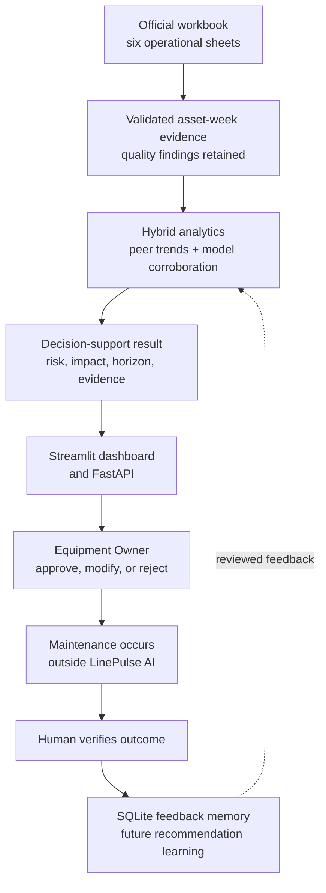

# Architecture

LinePulse AI separates the organizer's preparation artifacts from the prototype built during the two-day implementation window. The preparation side supplies the challenge definition and 100% synthetic workbook. The build side contains every transform, trained artifact, user interface, API, test, and feedback record created by the team.

The one-page submission view is [architecture.svg](architecture.svg).

## Preparation window versus two-day build

| Before the build window — organizer inputs | During the two-day build — team implementation |
|---|---|
| `Participant_Guide.docx` | Schema validator and six-sheet join |
| `Synthetic_Dataset_Report.docx` | Data-quality audit and confidence gate |
| `Synthetic_Dataset.xlsx` | Feature engineering and peer/trend evidence |
| Fixed synthetic seed and supplied `ScenarioFlag` | XGBoost training with group validation by `AssetID` |
| 45 Class A assets, three weekly snapshots | Risk/impact ranking and planning horizon |
| Six operational sheets plus facilitator material | Streamlit dashboard, FastAPI service, SQLite audit trail, automated tests, and documentation |

The hidden `ANSWER_KEY` is not read. `ScenarioFlag` is used only as the training target; it is never an input feature. Record IDs and asset IDs are join keys only.

## Runtime data flow

There is no path from LinePulse AI to a PLC, safety controller, automatic work order, or shutdown command.

## Analytical components

### Data contract

The loader reads six named operational sheets and validates required columns. It builds one asset-week grid using `AssetID`, `WeekStarting`, and `Line`. Shift-level production rows are aggregated before the join. Missing sensor weeks, duplicate work orders, and orphan maintenance records are reported.

### XGBoost seeded-degradation detector

The auxiliary model learns from the visible synthetic `ScenarioFlag` target. Inputs contain operational values and derived, non-identifier features, with maintenance features calculated as of each weekly row. All weeks belonging to a held-out asset remain outside training during validation. The model output is a seeded-degradation likelihood, not a field-failure probability. It is display-only corroboration with 0% RAG weight; core RAG and horizon logic remains measurement/trend based if the hint is absent.

### Transparent evidence and horizon

Peer/type baselines, latest levels, and observed slopes explain each risk. The system extrapolates unfavorable slopes to project-derived warning boundaries and combines this with maintenance and lifecycle urgency. The result is a planning horizon, not true RUL.

### Risk and impact

Technical risk and business impact remain separately visible. The priority queue combines them so users can understand why a high-impact, moderate-risk asset may outrank a lower-impact asset with a somewhat higher condition score.

### Human-in-the-loop feedback

The AI produces a recommendation, not an instruction. The Equipment Owner approves, modifies, or rejects it. Maintenance happens in the organization's existing process. A human later verifies the outcome.

The prototype stores decisions and verified outcomes in SQLite. Verified outcomes can influence the recommendation memory for comparable future cases and provide candidate labels for a later governed retraining cycle. An approval by itself is never treated as proof that the model was correct, and the XGBoost artifact is not silently retrained on each click.

When a verified resolution changes the displayed operational workflow state, the original model assessment remains immutable in the audit history. This avoids rewriting history.

## Trust boundaries

| Boundary | Guarantee |
|---|---|
| Source data | Official workbook remains unchanged |
| Model | Artifact is created by the documented training command and carries a source/feature-contract fingerprint so stale artifacts are rejected |
| Explanations | Values, fields, sources, baselines, and trends remain inspectable |
| Decisions | User, timestamp, choice, and optional modification are recorded |
| Outcomes | Only a human-verified result enters feedback memory |
| Equipment | No write capability exists |

## Why this is intentionally simple

- Local Excel keeps the supplied data inspectable.
- A single Python core prevents the UI and API from implementing different scoring logic.
- FastAPI creates a clean integration boundary without forcing cloud deployment.
- Streamlit delivers a strong interactive demo without a separate JavaScript build chain.
- SQLite provides durable, queryable audit history without an external database server.
- No Docker, Ignition, LLM, or EC2 dependency can break the core demo.

## Production evolution

The design can later replace the workbook adapter with historian/CMMS/MES/quality connectors while retaining the same internal evidence contract. A production version would add approved operating limits, authentication/roles, a model registry, drift monitoring, temporal validation, outcome governance, cybersecurity review, and safety/change-management approval.
